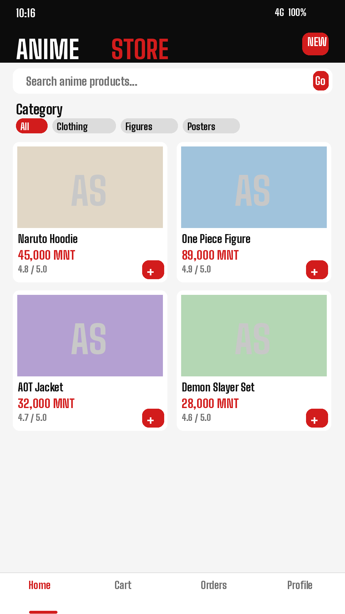
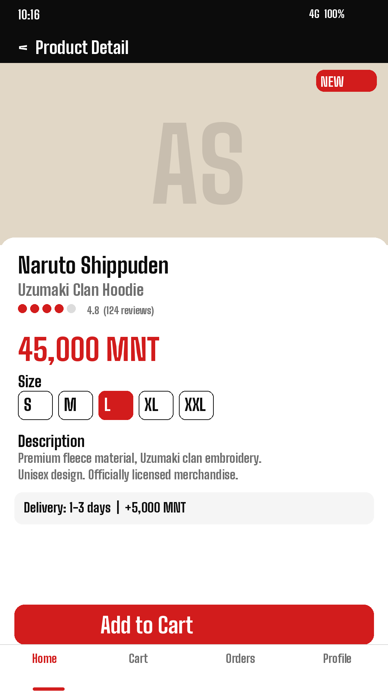
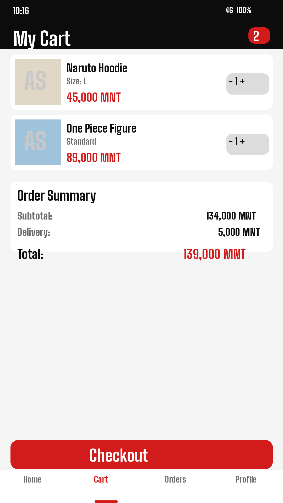
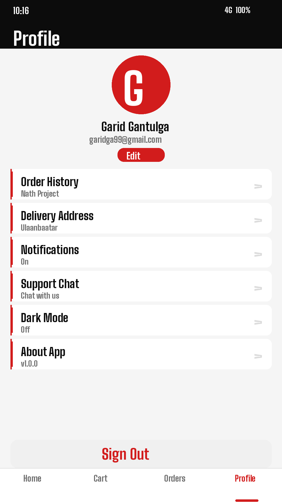

# Anime Store

<p align="center">
  
</p>

<p align="center">
  <strong>Mongolia's anime fashion shopping app</strong><br/>
  Browse, wishlist, and order acid-wash oversized t-shirts and hoodies featuring your favorite anime series — with real-time stock tracking, live discount events, and built-in admin chat.
</p>

---

## Tech Stack

| Layer | Technology |
|---|---|
| Language | Dart 3 |
| Framework | Flutter |
| Auth | Firebase Authentication |
| Database | Cloud Firestore |
| File Storage | Firebase Storage |
| State Management | Provider |
| Local Persistence | SharedPreferences |
| Image Caching | cached_network_image |
| Payment Deep Link | url_launcher (Khan Bank) |
| Photo Picker | image_picker |
| Ratings | flutter_rating_bar |

---

## What the App Does (Technical)

- **Firebase Auth** — email/password sign-up and login; role field in Firestore routes users to admin or customer views
- **Real-time Firestore listeners** — products, events, notifications, and wishlist all update live via `snapshots()` streams; no manual refresh needed
- **Per-size stock management** — each product stores a `stock` map `{S, M, L, XL, XXL}` updated atomically on order placement; UI disables sold-out sizes
- **Cart persistence** — cart is serialized as `productId|size` strings in SharedPreferences, keyed per user UID, so it survives app restarts
- **Discount event engine** — admins create time-bounded events targeting products by ID or category; supports both percent and fixed-amount discounts; applied live across cart and product listings
- **Wishlist sync** — stored as a Firestore subcollection under each user document; syncs across devices in real time
- **Order flow** — cart contents and delivery address are written to Firestore; payment is completed via a Khan Bank deep link; app detects app-resume to mark order confirmed
- **6-tab admin dashboard** — Products (CRUD + image upload), Orders (status management, 3-day deadline tracking), Events (discount creation), Users (order history per user), Revenue (month-by-month analytics), Notifications (push to all users)
- **In-app support chat** — admin and user exchange messages stored in Firestore; unread badge updates in real time on the notification bell
- **Dark / Light theme** — `ThemeNotifier` (Provider) persists preference and rebuilds the entire widget tree via a custom `AppColors` class
- **Firestore batch migration** — on first launch, detects missing `stock` field and back-fills all existing product documents in a single batch write
- **Product seeding** — `product_seed.dart` auto-seeds the Firestore `products` collection on an empty database so the app works out-of-the-box

---

## Screenshots

<p align="center">
  
  &nbsp;
  
  &nbsp;
  
  &nbsp;
  
</p>

---

## Running Locally

### Prerequisites

- [Flutter SDK](https://docs.flutter.dev/get-started/install) ≥ 3.0 on your `PATH`
- Android Studio or Xcode (for the emulator / physical device)
- A [Firebase](https://console.firebase.google.com/) project with **Authentication**, **Cloud Firestore**, and **Storage** enabled

### Steps

```bash
# 1. Clone the repo
git clone https://github.com/Garid999/OutFitHub.git
cd OutFitHub

# 2. Install dependencies
flutter pub get
```

**3. Wire up Firebase**

- In the [Firebase Console](https://console.firebase.google.com/), create a project and add an Android app (package name: `com.example.animestore`)
- Download `google-services.json` and place it at `android/app/google-services.json`
- In Firestore, start in **test mode** (or set up proper security rules)
- In Firebase Auth, enable the **Email/Password** sign-in provider

```bash
# 4. Run on a connected device or emulator
flutter run
```

On first launch the app seeds the product catalog automatically — no manual data entry needed.

**Admin access** — set `isAdmin: true` on any user document in Firestore to unlock the admin dashboard from the profile screen.

---

## License

© 2026 Anime Store — Garid Gantumur. All rights reserved.
